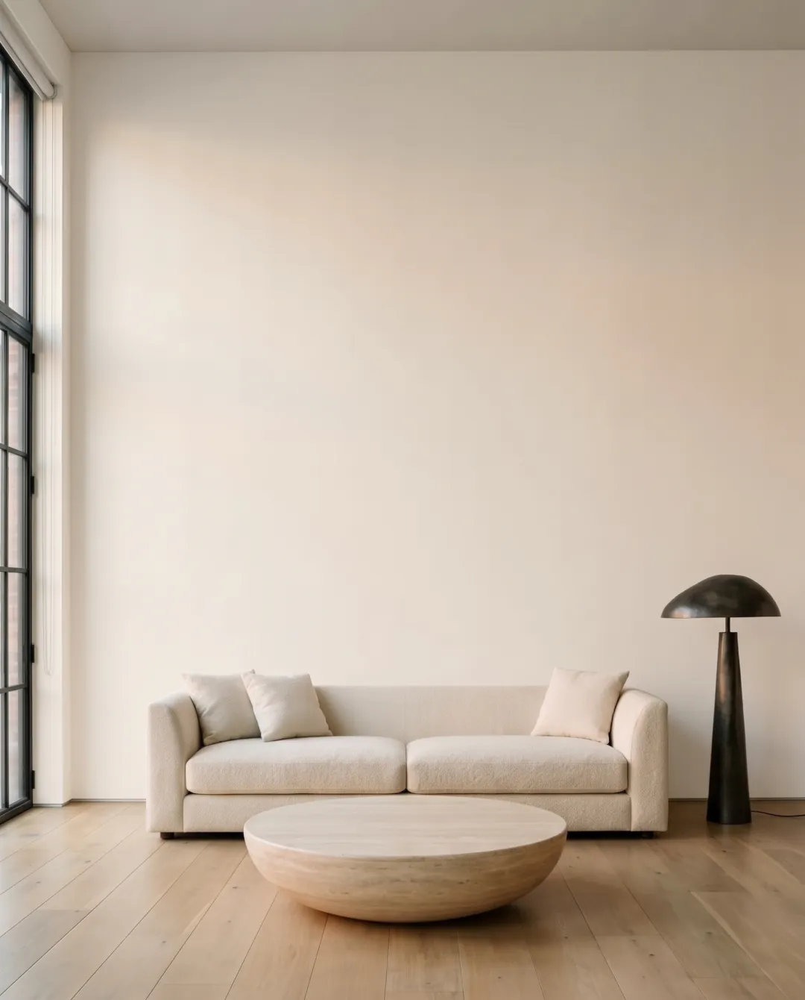
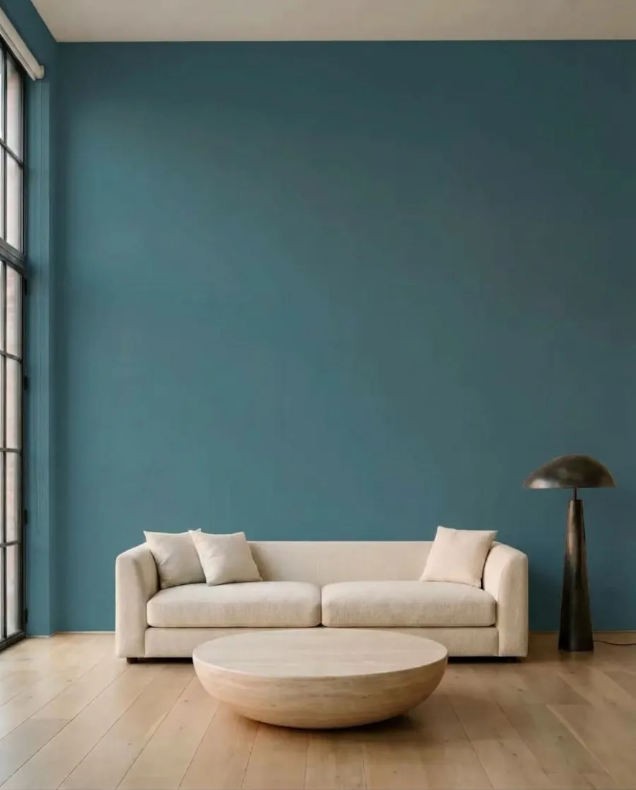
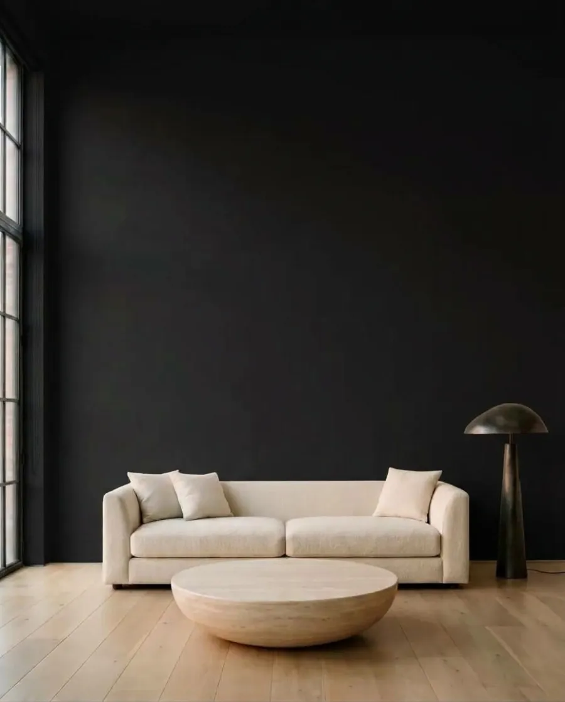
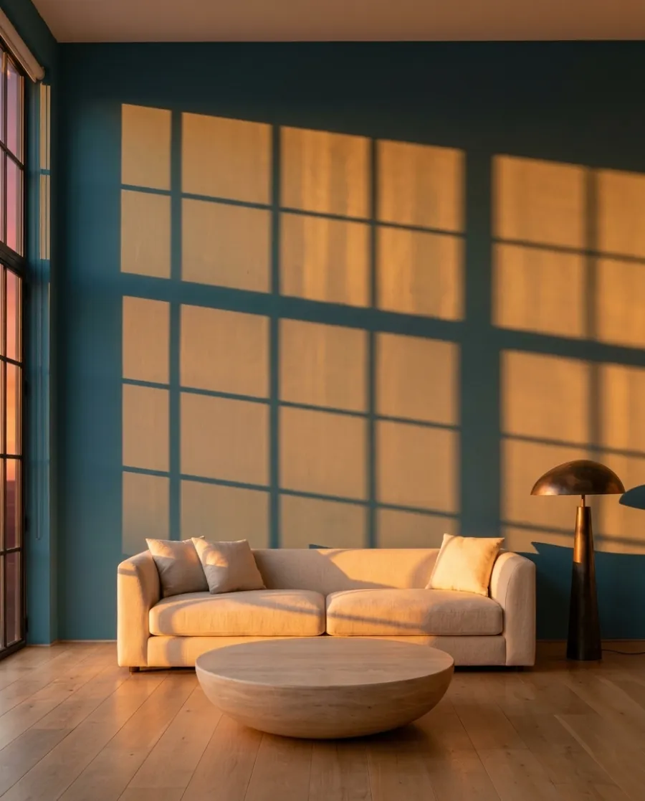

# muro — real paint colours in your terminal

Search 51,000+ paint colours from 35 brand catalogues, find the same colour in another brand,
and paint your own room photo with [Muro](https://usemuro.com): each result comes back as an
image, with the paint's brand, name and code, and a list of the closest paints you can buy.

```bash
npx usemuro colors search "agreeable gray"
npx usemuro colors equivalents "Farrow & Ball" "Hague Blue" --country PL

npm install -g usemuro   # then just: muro …
```

## Paint a photo

Painting uses a Muro API key and the credits of your Muro plan (1, 2 or 3 per colour for
Standard, HD or Ultra). Create a key at [app.usemuro.com](https://app.usemuro.com/ustawienia)
→ Settings → API keys.

```bash
muro login                      # paste the key once; stored in ~/.config/muro, or use MURO_API_KEY
muro visualize living-room.jpg \
  -c "Farrow & Ball:Hague Blue" -c "RAL 9005" \
  --country PL --out ./paint
```

```
1. Farrow & Ball Hague Blue (30) #3D4E57  [c1]
   → paint/01-farrow-ball-hague-blue.jpg
   Buy: Śnieżka S 7020-b10g ΔE 0.49 · Dulux (PL) S0.16.22 (1384825) ΔE 1.35 · Tikkurila M438 ΔE 2.33 · Flügger 4468 ΔE 2.35
2. RAL Colors Jet black (RAL 9005) #0E0E10  [c2]
   → paint/02-ral-colors-jet-black.jpg
   …
Project: https://app.usemuro.com/wynik/…
Cost: 2 credits.
```

| Before | Hague Blue | RAL 9005 | Hague Blue at sunset |
|---|---|---|---|
|  |  |  |  |

Real output of the commands above (`muro relight <project> c1 --time evening` for the last one).

## Commands

| Command | What it does |
|---|---|
| `muro colors search <query> [--brand B]` | Search by name or code (free) |
| `muro colors get <brand> <name-or-code>` | Exact lookup (free) |
| `muro colors equivalents <brand> <name-or-code>` / `--hex #RRGGBB` `[--country PL]` | Closest colours in other brands, CIEDE2000 (free) |
| `muro brands [--country PL]` | Brands, optionally by market (free) |
| `muro login [key]`, `muro logout`, `muro credits` | Key and balance |
| `muro visualize <photo\|url> -c <colour> …` `[--surface interior\|facade\|roof] [--quality standard\|hd\|ultra] [--ceiling] [--country PL] [--out DIR] [--yes]` | Paint 1–12 colours, full-resolution images plus a shopping list per colour |
| `muro relight <project-id> <colour-key> --time day\|evening\|night [--lamps]` | The same result in another light (1 credit) |

Colours: `#3D4E57`, `"Farrow & Ball:Hague Blue"`, `"Sherwin-Williams:SW 7029"`, `"RAL 9005"`.
Every command takes `--json` for scripts and agents. `visualize` asks before spending credits;
`--yes` skips the question (required when not in a terminal).

Screen colours approximate real paint. On the wall the result depends on the base, sheen and
tinting, so test a sample before you buy.

## For AI agents

The same features are available as an MCP server at `https://mcp.usemuro.com/mcp`
(see [usemuro.com/en/developers](https://usemuro.com/en/developers)).

Requires Node 20+. No dependencies.
